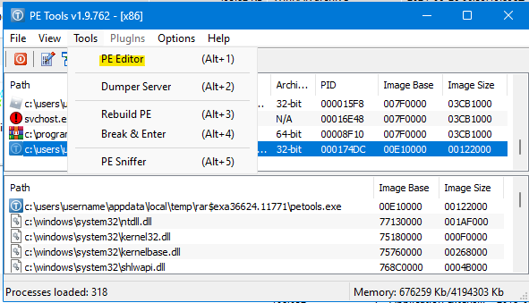
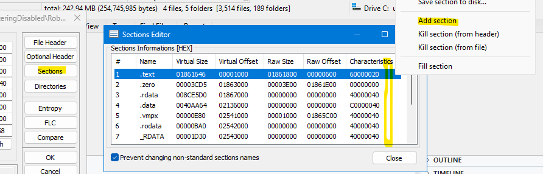
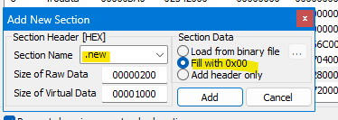

# So You Want to Add Your Own Strings to Rōblox 0.463?

Some of my patches (such as [one related to server-authoritative materials](../PatchMaterials/)) simply require replacing string data within the `exe`, such as `"rbxasset://textures/plastic/studs.dds"` with `"rbxassetid://rbxmtl-plastic-studs.dds"`. However, Rōblox player version v463 (early 2021) obfuscates strings in the `exe` _until loaded at runtime_.

Rōblox Freedom Distribution's solution is to add an empty megabyte onto which we can insert custom strings. Then, we use x32dbg to replace all the string references in code.

_This procedure only covers adding an empty megabyte onto which we can insert custom strings and targets ~v463._

Reach out to VisualPlugin if you need help with the instructions.

## Quick Procedure

Tools required:

- [PE Tools](https://github.com/petoolse/petools/releases)
- [ASRL Disabler](https://github.com/adamhlt/ASLR-Disabler)

Disclaimer: you can use better and more efficient methods than mine.

### Step 1: Launch PE Tools

Launch PE Tools, ignoring any warnings about `SeDebugPrivilege` that may show up.

In selecting _PE Editor_ (Alt + 1), open `RobloxPlayerBeta.exe` as a file.

### Step 2: Create New Section

Navigate to _Sections_, right-click anywhere on the _Sections Information_ box, then to _Add section_.

Add an empty section (with _Fill with 0x00_ selected). The name can be set to whatever you want. Maybe `.new`. Maybe `.rdata2`.

**Changes are written to the `exe` once you click _Add_.** You can then immediately close PE Tools.

### Step 6: Disable ASLR

Disable ASLR using the ASLR Disabler tool.

---

Your `RobloxPlayerBeta.exe` should've grown somewhat.

**Test if it works!** Open the new executable with or without command-line arguments. If arguments are not supplied, it's supposed to open a webpage on your default browser. If the new executable opens a webpage, it _should_ be able to launch games like normal.

This is what it'd look like for me:

