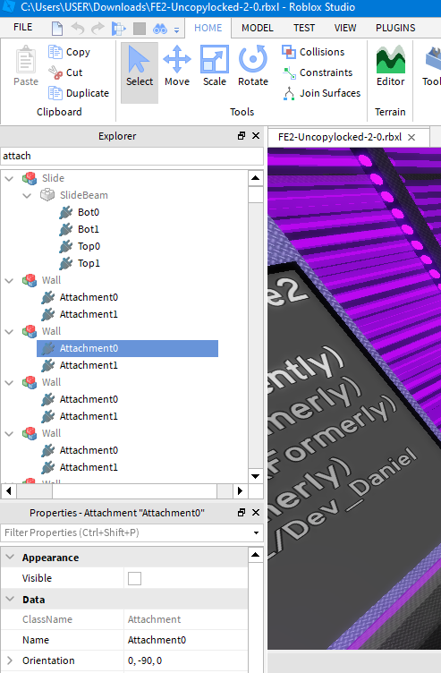
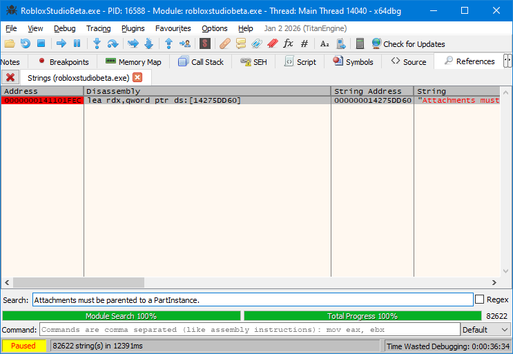

I have attached a file [`FE2-Uncopylocked-2-0.rbxl`](./FE2-Uncopylocked-2-0.zip), which were sent to me from [a GitHub issue](https://github.com/Windows81/Roblox-Freedom-Distribution/issues/136#issuecomment-3988220711) then serialised using Rōblox Freedom Distribution's `serialise` command.



---

However, Studio failed to open the place because error message `"Attachments must be parented to a PartInstance"` appears; there are `Model` objects with `Attachment` children.

I am including this patch in RFD because, as of December 2025, Attachments no longer have this parenting restriction in modern versions of Studio.

After implementing this patch, the place appears to loaded correctly. There are indeed `Attachment` objects parented to places that shouldn't be having them.

I implemented patches in Studio, Player, _and_ RCC to skip the function block which references `"Attachments must be parented to a PartInstance."`.

---



In v463 Studio, there is one reference located at `0000000141101FEC`.

```
0000000141101FEC | 48:8D15 6DBD6501         | lea rdx,qword ptr ds:[14275DD60]        | 000000014275DD60:"Attachments must be parented to a PartInstance."
```

Introduce a breakpoint at the statement. Then attempt to open the file again.

After the breakpoint is hit, trace the call stack in x64dbg:

```
Address          To               From             Size Party
0000000000145E78 0000000140CD5A6F 0000000141101FEC 360  User   robloxstudiobeta.0000000141101FEC
00000000001461D8 0000000140F96251 0000000140CD5A6F 110  User   robloxstudiobeta.0000000140CD5A6F
00000000001462E8 0000000140F975E5 0000000140F96251 3B0  User   robloxstudiobeta.0000000140F96251
0000000000146698 0000000140F944EC 0000000140F975E5 40   User   robloxstudiobeta.0000000140F975E5
00000000001466D8 0000000140F8C735 0000000140F944EC 50   User   robloxstudiobeta.0000000140F944EC
0000000000146728 000000014042E1FA 0000000140F8C735 1C0  User   robloxstudiobeta.0000000140F8C735
00000000001468E8 000000014042E9E9 000000014042E1FA 6B0  User   robloxstudiobeta.000000014042E1FA
0000000000146F98 0000000140442737 000000014042E9E9 1890 User   robloxstudiobeta.000000014042E9E9
0000000000148828 0000000140414BBF 0000000140442737 260  User   robloxstudiobeta.0000000140442737
...
```

Tracing up _one_ step to the function above, patch to skip the call and argument allocation in x86:

```patch
 0000000140CD5A60 | 49:8B06                  | mov rax,qword ptr ds:[r14]
 0000000140CD5A63 | 48:8BD3                  | mov rdx,rbx
 0000000140CD5A66 | 49:8BCE                  | mov rcx,r14
-0000000140CD5A69 | FF90 B8000000            | call qword ptr ds:[rax+B8]
+0000000140CD5A69 | 90                       | nop
+0000000140CD5A6A | 90                       | nop
+0000000140CD5A6B | 90                       | nop
+0000000140CD5A6C | 90                       | nop
+0000000140CD5A6D | 90                       | nop
+0000000140CD5A6E | 90                       | nop
```
