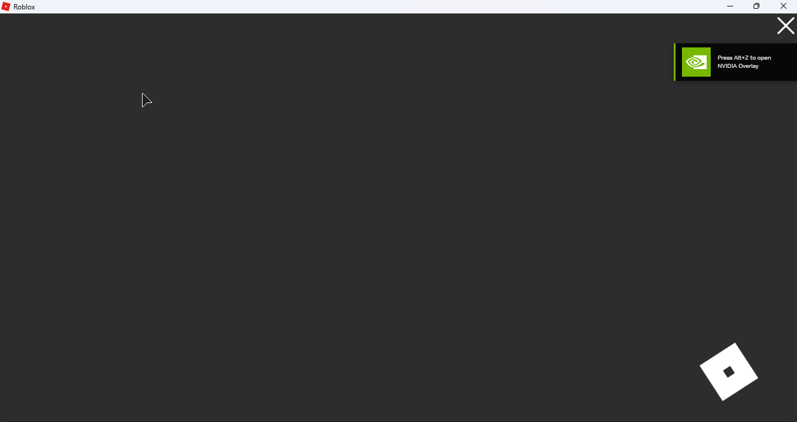

Reddit user \@Stunning_Art_2345 reported a problem which I could not easily reproduce. I reframed his messages into an [Issue](https://github.com/Windows81/Roblox-Freedom-Distribution/issues/201) on GitHub:

> I followed what you did in the video but the client just got stuck on the loading screen

> it pops up as normal but just doesnt load up the actual game:



## Triage

The culprit is probably quite interesting: his v347 RCCService is attempting to load FFlags, et c. from the _wrong_ URL. Instead of `/Setting/QuietGet/RCCService/`, he loads from `/Setting/QuietGet/RCCServicesCUEjOvfAStkcwZ7wCbt0D9c3OLxuRgzDBew9jr5Hf4qloF9/`.

Fortunately for us, v347 was only compiled only two years _after_ [what we have in the Rōblox 2016 source code](https://github.com/Artifaqt/ROBLOX2016/blob/main/RCCService/RCCServiceSoapServiceImpl.cpp#L1381), which tells us that:

```cpp
std::string CWebService::GetSettingsKey()
{
#ifdef RBX_TEST_BUILD
	if (RCCServiceSettingsKeyOverwrite.length() > 0)
		return RCCServiceSettingsKeyOverwrite;
#endif

	if (settingsKey.length() == 0)
	{
		CRegKey key;
		if (SUCCEEDED(key.Open(HKEY_LOCAL_MACHINE, "Software\\ROBLOX Corporation\\Roblox\\", KEY_READ)))
		{
			CHAR keyData[MAX_PATH];
			ULONG bufLen = MAX_PATH-1;
			if (SUCCEEDED(key.QueryStringValue("SettingsKey", keyData, &bufLen)))
			{
				keyData[bufLen] = 0;
				settingsKey = std::string(keyData);
				FASTLOGS(FLog::RCCServiceInit, "Read settings key: %s", settingsKey);
			}
		}

		if (settingsKey.length() != 0)
			settingsKey = "RCCService" + settingsKey;
	}

	return settingsKey;
}
```

From the code snippet, I assume that the user had a registry value stored at `Software\ROBLOX Corporation\Roblox\SettingsKey`. This was probably from another revival program they installed.

## Quick Guide

A fix should be easy. Our goal is to make sure the if-condition at `SUCCEEDED(key.Open(HKEY_LOCAL_MACHINE, "Software\\ROBLOX Corporation\\Roblox\\", KEY_READ))` is _always_ false.

### Step 1: Find String References

Find references to `"SettingsKey"`.

- In `RCCService.exe` v463, I found _one_ result appears.
- In `RCCService.exe` v347, _two_ results appear; follow the rest of the steps for both.

| Address    | Disassembly               | String Address | String          |
| ---------- | ------------------------- | -------------- | --------------- |
| `004A59EE` | `push rccservice.10BFC38` | `010BFC38`     | `"SettingsKey"` |
| `004A5A8A` | `push rccservice.10BFC38` | `010BFC38`     | `"SettingsKey"` |

### Step 2: Overwrite Assembly Bytes

Shortly after each reference to `"SettingsKey"`, you'll find a `call` statement. This likely jumps to `CRegKey::QueryStringValue`. Again: our goal is to make sure the corresponding if-condition is _always_ false.

This can be done by:

1. outright bypassing the `call` and its preceding `push` instructions, and
2. making the following `jl` into an unconditional `jmp`.

For example:

```patch
 004A5A76 | 7C 7C                    | jl rccservice.4A5AF4                 |
-004A5A78 | C745 EC 03010000         | mov dword ptr ss:[ebp-14],103        |
-004A5A7F | 8D4D EC                  | lea ecx,dword ptr ss:[ebp-14]        |
-004A5A82 | 51                       | push ecx                             |
-004A5A83 | 8D95 84FDFFFF            | lea edx,dword ptr ss:[ebp-27C]       |
-004A5A89 | 52                       | push edx                             |
-004A5A8A | 68 38FC0B01              | push rccservice.10BFC38              | 10BFC38:"SettingsKey"
-004A5A8F | 8D4D D4                  | lea ecx,dword ptr ss:[ebp-2C]        |
-004A5A92 | E8 79ECFFFF              | call rccservice.4A4710               |
-004A5A97 | 85C0                     | test eax,eax                         |
-004A5A99 | 7C 59                    | jl rccservice.4A5AF4                 |
+004A5A78 | 90                       | nop                                  |
+004A5A79 | 90                       | nop                                  |
+004A5A7A | 90                       | nop                                  |
+ ...
+004A5A97 | 90                       | nop                                  |
+004A5A98 | 90                       | nop                                  |
+004A5A99 | EB 59                    | jmp rccservice.4A5AF4                |
 004A5A9B | 8B45 EC                  | mov eax,dword ptr ss:[ebp-14]        |
 004A5A9E | C68405 84FDFFFF 00       | mov byte ptr ss:[ebp+eax-27C],0      |
```
