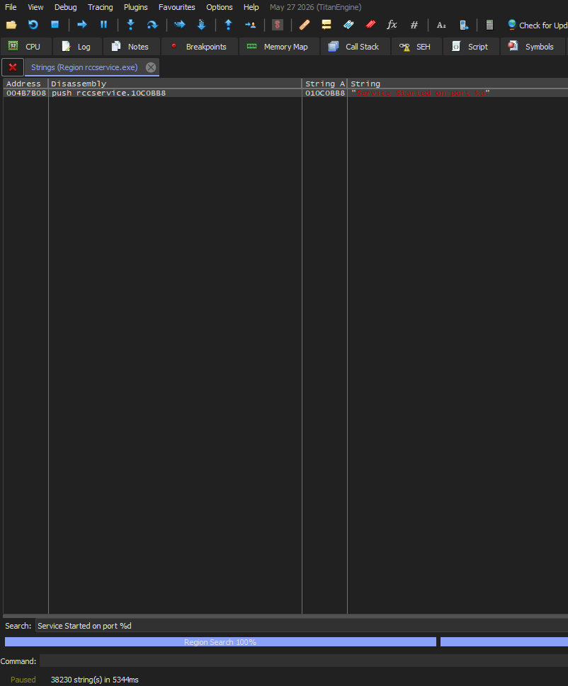
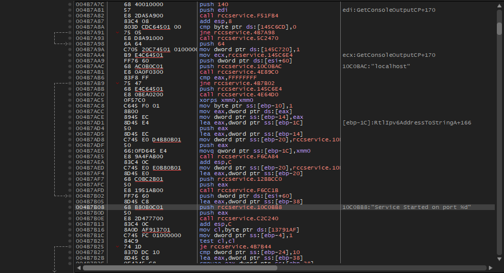
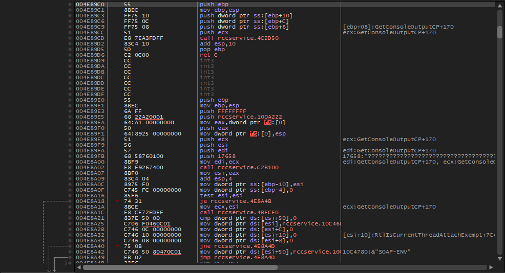
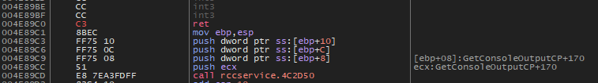
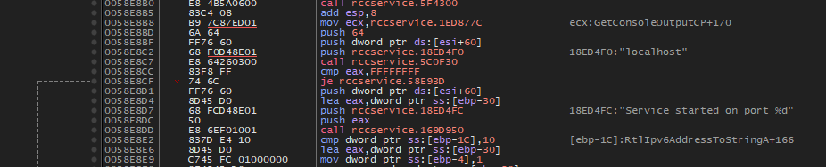

# Disable SOAP server on RCCServices

There was an [issue](https://github.com/Windows81/Roblox-Freedom-Distribution/issues/202) by VisualPlugin on the RFD's repository to completely disable the SOAP server, which is built into every RCCService.

This guide closes the issue.

## Patching Guide

Sample patches are avaliable [here](v347-server.1337) and [here](v463-server.1337) for `RCCService.exe` v347 (2018M) and v463 (2021E) accordingly.

### Why even a SOAP server exists?

There is actually a reason on SOAP existence in RCCServices.

Roblox uses a so-called "arbiter" program that orchestrates all of the running gameserver instances. And for it to talk to RCCServices (to open a gameserver job for example), the RCCService binds a TCP socket (but it is also openable in a browser, so we can count it as HTTP) internally on a specific port passed via `-port` argument in the CLi so the arbiter can send commands directly to the RCCService.

RFD doesn't need the SOAP server at all! It uses the so called "gameserver JSON file" to open a gameserver job. The SOAP server also creates a huge vulnerability risk (see [this PoC](https://github.com/novalabs-org/rbx-vulnerabilities/blob/main/security-poc/poc5_rcc_soap_exec.py)).

### The patch

Looking at the [2016 source code](https://github.com/Artifaqt/ROBLOX2016/blob/e0cfac59fea3a5b986843e65b0fda286e439f9fc/RCCService/RCCService.cpp#L148):

```cpp
static void startupRCC(int port, LPCTSTR contentpath, bool crashUploaderOnly)
{
	printf("Service starting...\n"); 

	start_CWebService(contentpath, crashUploaderOnly);

  //service.send_timeout = 60; // 60 seconds 
  //service.recv_timeout = 60; // 60 seconds 
  service.accept_timeout = 1; // server stops after 1 second
  //soap.max_keep_alive = 100; // max keep-alive sequence 
  SOAP_SOCKET m = service.bind(NULL, port, 100); 
  if (!soap_valid_socket(m)) 
	  throw std::runtime_error(*soap_faultstring(&service)); 

	char buffer[64];
	sprintf_s(buffer, 64, "Service Started on port %d", port); 
	RBX::StandardOut::singleton()->print(RBX::MESSAGE_SENSITIVE, buffer);
	SvcReportEvent(EVENTLOG_INFORMATION_TYPE, buffer);
}
```

We can see a very interesting code block:

```cpp
  SOAP_SOCKET m = service.bind(NULL, port, 100); 
  if (!soap_valid_socket(m)) 
	  throw std::runtime_error(*soap_faultstring(&service)); 
```

That is the TCP binding! We have to find it in assembly now though.

Though it's not an issue at all, since both 2018 and 2021 RCCServices share (almost) the same codebase as 2016 in the SOAP starting code.

### x32dbg Patch for 2018

Let's search for `Service Started on port %d`. Of course we have a match since it literally shows in the console:



Double click it. We see this now:



This looks very promising:

```
004B7A98 | 6A 64                    | push 64                                 |
004B7A9A | C705 20C74501 01000000   | mov dword ptr ds:[145C720],1            |
004B7AA4 | B9 E4C64501              | mov ecx,rccservice.145C6E4              | ecx:GetConsoleOutputCP+170
004B7AA9 | FF76 60                  | push dword ptr ds:[esi+60]              |
004B7AAC | 68 AC0B0C01              | push rccservice.10C0BAC                 | 10C0BAC:"localhost"
004B7AB1 | E8 0A0F0300              | call rccservice.4E89C0                  |
004B7AB6 | 83F8 FF                  | cmp eax,FFFFFFFF                        |
004B7AB9 | 75 47                    | jne rccservice.4B7B02                   |
004B7ABB | 68 E4C64501              | push rccservice.145C6E4                 |
004B7AC0 | E8 0BEA0200              | call rccservice.4E64D0                  |
004B7AC5 | 0F57C0                   | xorps xmm0,xmm0                         |
004B7AC8 | C645 F0 01               | mov byte ptr ss:[ebp-10],1              |
004B7ACC | 8B00                     | mov eax,dword ptr ds:[eax]              |
```

especially the call with `cmp` under it. Let's double click that call.



This looks **REALLY** promising, since there is a "SOAP-ENV" string a couple of instructions later!

We just replace the selected push edp in the screenshot with `ret` by using space and save the patch.



### x32dbg Patch for 2021

The situation here is very similar, so I will just skip most of the part.

Same pattern: call with a cmp instruction:



Double click it, press space and `ret`. Save the patch.