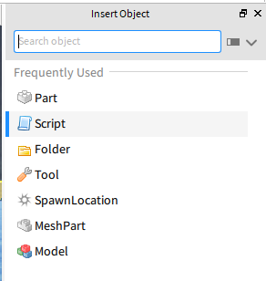

In Studio v463, I've had problems getting the _Insert Objects_ window to show anything more than a curation of seven items in the _Frequently Used_ section. The variety of items changes per the ClassName of any object(s) you have selected.

To work around this problem, you can run the following in the command bar:

```lua
Instance.new('{OBJECT_TYPE}', game.Selection:Get()[1])
```

### `InsertObjectWidget::populateList` Testing

One might think that patching `InsertObjectWidget::populateList` could fix it.

However, **that is an incorrect approach**.

According to the v548 PDB symbols, the same method is externally called _once_. The caller in question is `RBX::InsertObjectUtils::createWidgets`, which contains the following strings in v548:

1. `"DataStoreService"`
2. `"Studio"`
3. `"AnalyticsService"`

The precise location of `populateList` comes immediately before an if-statement, followed later by a call to `QListData::begin`:

```cpp
v40._Ptr = pDataModel->_Ptr;
v40._Rep = v27;
anonymous_namespace_::populateList(services, v26, v5, &v40, &ignoreList);
if ( v26->p.d->ref.atomic._q_value._Storage._Value > 1u )
	QList<QListWidgetItem *>::detach_helper((QList<QCheckBox *> *)v26, v26->p.d->alloc);
for ( i = QListData::begin(&v26->p); ; ++i ) ...
```

The `call` instruction is located at `00000001405148B8` in v463 Studio.

Upon skipping the call completely, **there is no apparent change in behaviour**. Still, only the _Frequently Used_ items show up.

```patch
 00000001405148AE | 4C:8BC3                  | mov r8,rbx
 00000001405148B1 | 48:8BD6                  | mov rdx,rsi
 00000001405148B4 | 41:0FB6CD                | movzx ecx,r13b
 00000001405148B8 | E8 A3110000              | call robloxstudiobeta.140515A60
 00000001405148BD | 48:8B06                  | mov rax,qword ptr ds:[rsi]
 00000001405148C0 | 8338 01                  | cmp dword ptr ds:[rax],1
 00000001405148C3 | 76 0B                    | jbe robloxstudiobeta.1405148D0
 00000001405148C5 | 8B50 04                  | mov edx,dword ptr ds:[rax+4]
 00000001405148C8 | 48:8BCE                  | mov rcx,rsi
-00000001405148CB | E8 E060D5FF              | call robloxstudiobeta.14026A9B0
+00000001405148B8 | 90                       | nop
+00000001405148B9 | 90                       | nop
+00000001405148BA | 90                       | nop
+00000001405148BB | 90                       | nop
+00000001405148BC | 90                       | nop
 00000001405148D0 | 48:8BCE                  | mov rcx,rsi
 00000001405148D3 | FF15 3F43BB01            | call qword ptr ds:[<public: void ** __cdecl QListData::begin(void) const>]
```

| Before         | After          |
| -------------- | -------------- |
|  |  |

### Searching Through `StudioStringsTranslated.csv`

Rōblox Studio stores most user-facing strings in a localisation file named `StudioStringsTranslated.csv`. When searching through the files, you'll find plenty which refer to an `InsertObjectCategory` namespace.

Note that the "Frequently Used" string visible in the _Insert Objects_ screenshots corresponds to `Studio.App.InsertObjectCategory.FavoritesCategory`.

```csv
Studio.App.InsertObjectCategory.3DInterfaces,,3D Interfaces,3D Interfaces
Studio.App.InsertObjectCategory.Adornments,,Adornments,Adornments
Studio.App.InsertObjectCategory.Animations,,Animations,Animations
Studio.App.InsertObjectCategory.Avatar,,Avatar,Avatar
Studio.App.InsertObjectCategory.Constraints,,Constraints,Constraints
Studio.App.InsertObjectCategory.Effects,,Effects,Effects
Studio.App.InsertObjectCategory.Environment,,Environment,Environment
Studio.App.InsertObjectCategory.FavoritesCategory,,Frequently Used,Frequently Used
Studio.App.InsertObjectCategory.GUI,,GUI,GUI
Studio.App.InsertObjectCategory.Interaction,,Interaction,Interaction
Studio.App.InsertObjectCategory.LegacyBodyMovers,,Legacy Body Movers,Legacy Body Movers
Studio.App.InsertObjectCategory.Lights,,Lights,Lights
Studio.App.InsertObjectCategory.Localization,,Localization,Localization
Studio.App.InsertObjectCategory.Meshes,,Meshes,Meshes
Studio.App.InsertObjectCategory.Parts,,Parts,Parts
Studio.App.InsertObjectCategory.PostProcessingEffects,,Post Processing Effects,Post Processing Effects
Studio.App.InsertObjectCategory.Scripting,,Scripting,Scripting
Studio.App.InsertObjectCategory.Sounds,,Sounds,Sounds
Studio.App.InsertObjectCategory.Uncategorized,,Uncategorized,Uncategorized
```

Let's use IDA on v548 to search for other strings in the namespace.

One candidate is `"Uncategorized"`. You'll find it being used once in `InsertObjectModel::populateModel`, which is a rather large function. This `InsertObjectModel::populateModel` function is only ever called by an intermediate lambda which belongs to function `InsertObjectMenuFactory::InsertObjectMenuFactory`:

```cpp
InsertObjectMenuFactory *__fastcall InsertObjectMenuFactory::InsertObjectMenuFactory(InsertObjectMenuFactory *this)
{
  InsertObjectFavoritesContainer *v2; // rax
  InsertObjectFavoritesContainer *inserted; // rax
  ILoginManager *v4; // rdi
  Qt::ConnectionType *connection_type; // rax
  QMetaObject::Connection v7; // [rsp+78h] [rbp+10h] BYREF
  struct QObject v8; // [rsp+80h] [rbp+18h] BYREF

  this->m_insertWindow.wp.d = nullptr;
  this->m_insertWindow.wp.value = nullptr;
  this->m_lastUnexpandedLayoutPosition.first = 0;
  this->m_lastUnexpandedLayoutPosition.second = 0;
  *(_WORD *)&this->m_insertWindowInitialized = 0;
  v2 = (InsertObjectFavoritesContainer *)operator new(0x60u);
  v7.d_ptr = v2;
  if ( v2 )
    inserted = InsertObjectFavoritesContainer::InsertObjectFavoritesContainer(v2);
  else
    inserted = nullptr;
  this->m_favoritesContainer._Mypair._Myval2 = inserted;
  this->m_insertObjectModel.wp.d = nullptr;
  this->m_insertObjectModel.wp.value = nullptr;
  v4 = SingletonInterfaceFetcher::getInterface<ILoginManager>();
  v7.d_ptr = ILoginManager::loginSuccess;
  connection_type = (Qt::ConnectionType *)operator new(0x18u);
  v8.d_ptr.d = (QObjectData *)connection_type;
  if ( connection_type )
  {
    *connection_type = DirectConnection;
    *((_QWORD *)connection_type + 1) = QtPrivate::QFunctorSlotObject__lambda_efcd07340833deac7b267b072c7a6d7f__1_QtPrivate::List_QString_const____void_::impl;
  }
  else
  {
    LODWORD(connection_type) = 0;
  }
  QObject::connectImpl(
    &v8,
    (void **)&v4->__vftable,
    (const struct QObject *)&v7,
    (void **)&v4->__vftable,
    nullptr,
    (enum Qt::ConnectionType)connection_type,
    (const int *)1,
    nullptr);
  QMetaObject::Connection::~Connection((QMetaObject::Connection *)&v8);
  return this;
}
```

Per the snippet, it appears that the lamda in question gets called when `ILoginManager::loginSuccess` gets invoked. The invokation never occurs since [a previous patch was made](../StudioLogin/) so that Studio never registers that a user is logged in.
