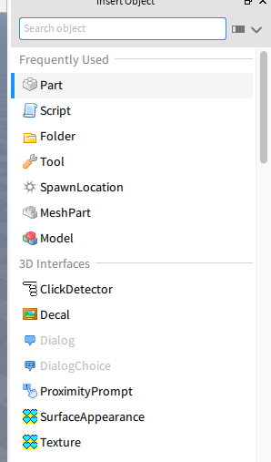
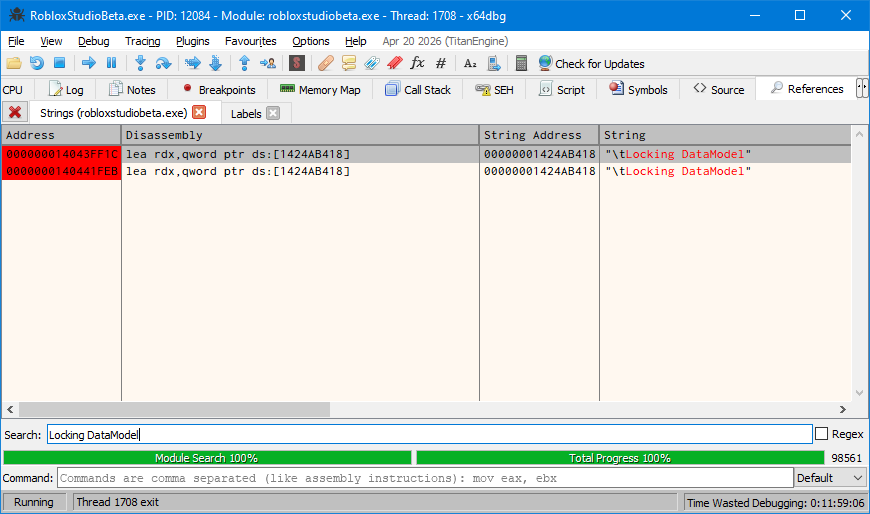

| Before         | After            |
| -------------- | ---------------- |
|  |  |

In Studio v463, I've had problems getting the _Insert Objects_ window to show anything more than a curation of seven items in the _Frequently Used_ section. The variety of items changes per the ClassName of any object(s) you have selected.

To work around this problem, you can run the following in the command bar:

```lua
Instance.new('{OBJECT_TYPE}', game.Selection:Get()[1])
```

### `InsertObjectWidget::populateList` Testing

One might think that patching `InsertObjectWidget::populateList` could fix it.

A function with the same name exists [in the 2016 source code](https://github.com/Artifaqt/ROBLOX2016/blob/e0cfac59fea3a5b986843e65b0fda286e439f9fc/RobloxStudio/CommonInsertWidget.cpp#L152).

However, **that is an incorrect approach**.

According to the v548 PDB symbols, the same method is externally called _once_. The caller in question is `RBX::InsertObjectUtils::createWidgets`, which contains the following strings in v548:

1. `"DataStoreService"`
2. `"Studio"`
3. `"AnalyticsService"`

The precise location of `populateList` comes immediately before an if-statement, followed later by a call to `QListData::begin`:

```cpp
v40._Ptr = pDataModel->_Ptr;
v40._Rep = v27;
anonymous_namespace_::populateList(services, v26, v5, &v40, &ignoreList);
if ( v26->p.d->ref.atomic._q_value._Storage._Value > 1u )
	QList<QListWidgetItem *>::detach_helper((QList<QCheckBox *> *)v26, v26->p.d->alloc);
for ( i = QListData::begin(&v26->p); ; ++i ) ...
```

The `call` instruction is located at `00000001405148B8` in v463 Studio.

Upon skipping the call completely, **there is no apparent change in behaviour**. Still, only the _Frequently Used_ items show up.

```patch
 00000001405148AE | 4C:8BC3                  | mov r8,rbx
 00000001405148B1 | 48:8BD6                  | mov rdx,rsi
 00000001405148B4 | 41:0FB6CD                | movzx ecx,r13b
 00000001405148B8 | E8 A3110000              | call robloxstudiobeta.140515A60
 00000001405148BD | 48:8B06                  | mov rax,qword ptr ds:[rsi]
 00000001405148C0 | 8338 01                  | cmp dword ptr ds:[rax],1
 00000001405148C3 | 76 0B                    | jbe robloxstudiobeta.1405148D0
 00000001405148C5 | 8B50 04                  | mov edx,dword ptr ds:[rax+4]
 00000001405148C8 | 48:8BCE                  | mov rcx,rsi
-00000001405148CB | E8 E060D5FF              | call robloxstudiobeta.14026A9B0
+00000001405148B8 | 90                       | nop
+00000001405148B9 | 90                       | nop
+00000001405148BA | 90                       | nop
+00000001405148BB | 90                       | nop
+00000001405148BC | 90                       | nop
 00000001405148D0 | 48:8BCE                  | mov rcx,rsi
 00000001405148D3 | FF15 3F43BB01            | call qword ptr ds:[<public: void ** __cdecl QListData::begin(void) const>]
```

| Before         | After          |
| -------------- | -------------- |
|  |  |

### Searching Through `StudioStringsTranslated.csv`

Rōblox Studio stores most user-facing strings in a localisation file named `StudioStringsTranslated.csv`. When searching through the files, you'll find plenty which refer to an `InsertObjectCategory` namespace.

Note that the "Frequently Used" string visible in the _Insert Objects_ screenshots corresponds to `Studio.App.InsertObjectCategory.FavoritesCategory`.

```csv
Studio.App.InsertObjectCategory.3DInterfaces,,3D Interfaces,3D Interfaces
Studio.App.InsertObjectCategory.Adornments,,Adornments,Adornments
Studio.App.InsertObjectCategory.Animations,,Animations,Animations
Studio.App.InsertObjectCategory.Avatar,,Avatar,Avatar
Studio.App.InsertObjectCategory.Constraints,,Constraints,Constraints
Studio.App.InsertObjectCategory.Effects,,Effects,Effects
Studio.App.InsertObjectCategory.Environment,,Environment,Environment
Studio.App.InsertObjectCategory.FavoritesCategory,,Frequently Used,Frequently Used
Studio.App.InsertObjectCategory.GUI,,GUI,GUI
Studio.App.InsertObjectCategory.Interaction,,Interaction,Interaction
Studio.App.InsertObjectCategory.LegacyBodyMovers,,Legacy Body Movers,Legacy Body Movers
Studio.App.InsertObjectCategory.Lights,,Lights,Lights
Studio.App.InsertObjectCategory.Localization,,Localization,Localization
Studio.App.InsertObjectCategory.Meshes,,Meshes,Meshes
Studio.App.InsertObjectCategory.Parts,,Parts,Parts
Studio.App.InsertObjectCategory.PostProcessingEffects,,Post Processing Effects,Post Processing Effects
Studio.App.InsertObjectCategory.Scripting,,Scripting,Scripting
Studio.App.InsertObjectCategory.Sounds,,Sounds,Sounds
Studio.App.InsertObjectCategory.Uncategorized,,Uncategorized,Uncategorized
```

Let's use IDA Pro 9.3 on v548 to search for other strings in the namespace.

My candidate string was `"Uncategorized"`.

In v463, there is one reference to `"Uncategorized"`. In v548, it is referenced twice and you need to select the correct usage.

The reference you're looking for is in `InsertObjectModel::populateModel`, which is a rather large function. You'll know you're in the right place when `"StandalonePluginScripts"` also appears, and if the function itself is recursive.

This recursive `InsertObjectModel::populateModel` function is only ever called _externally_ by a lambda function via `jmp`. The base of that lambda function in v463 Studio is at `00000001403AA240`.

The body, as generated by IDA, is shown below:

```cpp
// Hidden C++ exception states: #wind=1
void __fastcall lambda_efcd07340833deac7b267b072c7a6d7f_::operator()(const QString *username)
{
  __int64 v1; // rdx
  __int64 v2; // rcx
  InsertObjectMenuFactory *Instance; // rdi
  __int64 v4; // rdx
  __int64 v5; // rcx
  QObject *v6; // rax
  struct QThread *thread; // rbx
  QtSharedPointer::ExternalRefCountData *d; // rax
  InsertObjectModel *v9; // rbx
  InsertObjectModel *value; // rcx
  QtSharedPointer::ExternalRefCountData *v11; // rax

  Instance = InsertObjectMenuFactory::getInstance();
  if ( FFlag::DebugFatalAssertMainThread.value )
  {
    if ( QCoreApplication::instance(v2, v1) )
    {
      v6 = (QObject *)QCoreApplication::instance(v5, v4);
      thread = QObject::thread(v6);
      if ( (struct QThread *)QThread::currentThread() != thread )
        RBXCRASH("AssertMainThreadFailure", pass);
    }
  }
  d = Instance->m_insertObjectModel.wp.d;
  v9 = nullptr;
  if ( d && d->strongref._q_value._Storage._Value )
    value = (InsertObjectModel *)Instance->m_insertObjectModel.wp.value;
  else
    value = nullptr;
  InsertObjectModel::resetModel(value);
  v11 = Instance->m_insertObjectModel.wp.d;
  if ( v11 && v11->strongref._q_value._Storage._Value )
    v9 = (InsertObjectModel *)Instance->m_insertObjectModel.wp.value;
  if ( __TSS0__1__rootDescriptor_ClassDescriptor_Reflection_RBX__SAAEAV234_XZ_4HA > *(_DWORD *)(*((_QWORD *)NtCurrentTeb()->Reserved1[11]
                                                                                                + (unsigned int)tls_index)
                                                                                              + 260LL) )
  {
    Init_thread_header(&__TSS0__1__rootDescriptor_ClassDescriptor_Reflection_RBX__SAAEAV234_XZ_4HA);
    if ( __TSS0__1__rootDescriptor_ClassDescriptor_Reflection_RBX__SAAEAV234_XZ_4HA == -1 )
    {
      RBX::Reflection::ClassDescriptor::ClassDescriptor(&`RBX::Reflection::ClassDescriptor::rootDescriptor'::`2'::root);
      atexit(`RBX::Reflection::ClassDescriptor::rootDescriptor'::`2'::`dynamic atexit destructor for 'root'');
      Init_thread_footer(&__TSS0__1__rootDescriptor_ClassDescriptor_Reflection_RBX__SAAEAV234_XZ_4HA);
    }
  }
  InsertObjectModel::populateModel(
    (QTypedArrayData<unsigned short> *)&`RBX::Reflection::ClassDescriptor::rootDescriptor'::`2'::root,
    v9,
    nullptr);
}
```

Even though a `const QString *username` argument is specified, it isn't used anywhere in the function body. This makes hooking a call to the lambda surprisingly easy. There is no need for registers or data to be nodified prior to entering the function.

### Why Need a Patch?

Note that lambda is only _normally_ reached from:

- another intermediate lambda (also via `jmp`) which belongs to
- a named function `InsertObjectMenuFactory::InsertObjectMenuFactory`.

Per the snippet for `InsertObjectMenuFactory::InsertObjectMenuFactory` below, it appears that the aforementioned lambda function gets called when `ILoginManager::loginSuccess` gets invoked. However, the invokation never occurs since [a previous patch](../StudioLogin/) has the side effect of suppressing much activity from `ILoginManager::loginSuccess`.

The IDA-generated body is shown below:

```cpp
InsertObjectMenuFactory *__fastcall InsertObjectMenuFactory::InsertObjectMenuFactory(InsertObjectMenuFactory *this)
{
  InsertObjectFavoritesContainer *v2; // rax
  InsertObjectFavoritesContainer *inserted; // rax
  ILoginManager *v4; // rdi
  Qt::ConnectionType *connection_type; // rax
  QMetaObject::Connection v7; // [rsp+78h] [rbp+10h] BYREF
  struct QObject v8; // [rsp+80h] [rbp+18h] BYREF

  this->m_insertWindow.wp.d = nullptr;
  this->m_insertWindow.wp.value = nullptr;
  this->m_lastUnexpandedLayoutPosition.first = 0;
  this->m_lastUnexpandedLayoutPosition.second = 0;
  *(_WORD *)&this->m_insertWindowInitialized = 0;
  v2 = (InsertObjectFavoritesContainer *)operator new(0x60u);
  v7.d_ptr = v2;
  if ( v2 )
    inserted = InsertObjectFavoritesContainer::InsertObjectFavoritesContainer(v2);
  else
    inserted = nullptr;
  this->m_favoritesContainer._Mypair._Myval2 = inserted;
  this->m_insertObjectModel.wp.d = nullptr;
  this->m_insertObjectModel.wp.value = nullptr;
  v4 = SingletonInterfaceFetcher::getInterface<ILoginManager>();
  v7.d_ptr = ILoginManager::loginSuccess;
  connection_type = (Qt::ConnectionType *)operator new(0x18u);
  v8.d_ptr.d = (QObjectData *)connection_type;
  if ( connection_type )
  {
    *connection_type = DirectConnection;
    *((_QWORD *)connection_type + 1) = QtPrivate::QFunctorSlotObject__lambda_efcd07340833deac7b267b072c7a6d7f__1_QtPrivate::List_QString_const____void_::impl;
  }
  else
  {
    LODWORD(connection_type) = 0;
  }
  QObject::connectImpl(
    &v8,
    (void **)&v4->__vftable,
    (const struct QObject *)&v7,
    (void **)&v4->__vftable,
    nullptr,
    (enum Qt::ConnectionType)connection_type,
    (const int *)1,
    nullptr);
  QMetaObject::Connection::~Connection((QMetaObject::Connection *)&v8);
  return this;
}
```

When that `QObject` connection is being made, v463 Studio stores the address of `InsertObjectMenuFactory* this` at `00000001432BDED0`.

### Placing the Function Call

We want our special lambda function to be called as few times as possible.

Looking at any log files generated by Studio, a string `"\tLocking DataModel"` always gets printed when a place is opened. **I am assuming that any code which references that string is reached only once, each time a place is opened.**

I would put a breakpoint on every user reference to `"\tLocking DataModel"`. In v463, there are two instances of that string. In v548, there is only one instance.



After setting breakpoints, I would restart `RobloxStudioBeta.exe` and launch a place. Then, once a breakpoint is hit, I would make x64dbg execute to the next `ret`. Expect to be thrust forward _thousands_ of bytes.

My final patch involves replacing the end of that hige intialisation function with a `jmp` directly to the aforementioned lambda:

```patch
 0000000140443206 | 49:8BE3                  | mov rsp,r11
 0000000140443209 | 41:5F                    | pop r15
 000000014044320B | 41:5E                    | pop r14
 000000014044320D | 41:5D                    | pop r13
 000000014044320F | 41:5C                    | pop r12
 0000000140443211 | 5F                       | pop rdi
 0000000140443212 | 5E                       | pop rsi
-0000000140443213 | 5B                       | pop rbx
-0000000140443214 | C3                       | ret
+0000000140443213 | EB 51                    | jmp robloxstudiobeta.140443266
 0000000140443215 | 48:8D15 A4810602         | lea rdx,qword ptr ds:[1424AB3C0]
 00000001424AB3C0:"Cannot initialize cloud edit chat"
 000000014044321C | 48:8D8C24 40100000       | lea rcx,qword ptr ss:[rsp+1040]
 0000000140443224 | E8 3701DFFF              | call robloxstudiobeta.140233360
 0000000140443229 | 48:8D15 A023C502         | lea rdx,qword ptr ds:[1430955D0]
 0000000140443230 | 48:8D8C24 40100000       | lea rcx,qword ptr ss:[rsp+1040]
 0000000140443238 | E8 B1A29D01              | call <JMP.&_CxxThrowException>
 000000014044323D | CC                       | int3
 000000014044323E | 48:8D15 7B810602         | lea rdx,qword ptr ds:[1424AB3C0]
 0000000140443245 | 48:8D8C24 58100000       | lea rcx,qword ptr ss:[rsp+1058]
 000000014044324D | E8 0E01DFFF              | call robloxstudiobeta.140233360
 0000000140443252 | 48:8D15 7723C502         | lea rdx,qword ptr ds:[1430955D0]
 0000000140443259 | 48:8D8C24 58100000       | lea rcx,qword ptr ss:[rsp+1058]
 0000000140443261 | E8 88A29D01              | call <JMP.&_CxxThrowException>
-0000000140443266 | CC                       | int3
-0000000140443267 | CC                       | int3
-0000000140443268 | CC                       | int3
-0000000140443269 | CC                       | int3
-000000014044326A | CC                       | int3
-000000014044326B | CC                       | int3
+0000000140443266 | 5B                       | pop rbx
+0000000140443267 | E9 D46FF6FF              | jmp robloxstudiobeta.1403AA240
```

| Before         | After            |
| -------------- | ---------------- |
|  |  |
